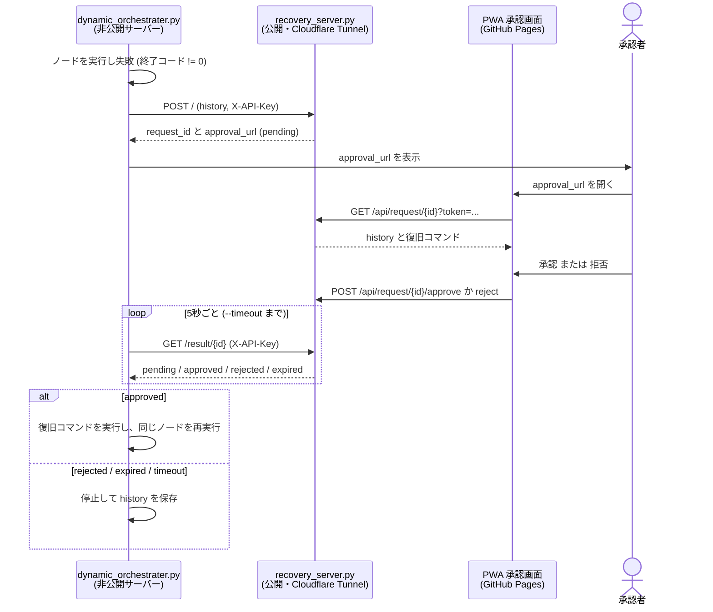
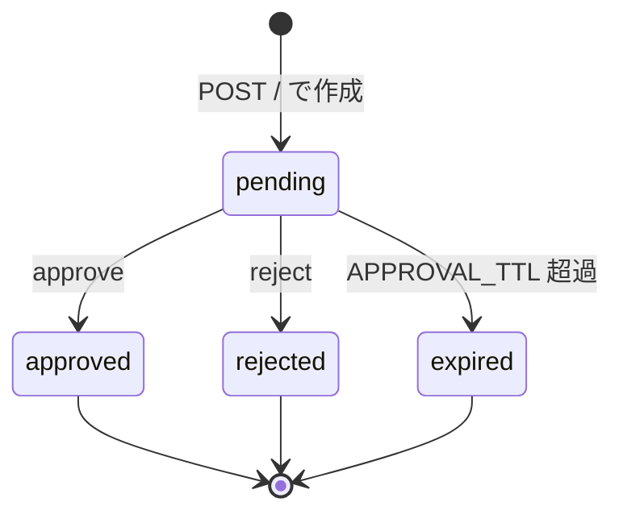

# gromacs-master_v2

GROMACS の分子動力学シミュレーションを、JSON で定義した**ノードのグラフ**として順番に実行するオーケストレーターです。
ノードが失敗したとき、**人間の承認を挟んで**復旧コマンドを実行し、同じノードをやり直せます。

- ノードとその遷移を JSON (plan) で宣言する
- 失敗したら履歴を復旧サーバーへ送り、スマホ等の PWA で承認してから復旧コマンドを実行する
- 実行結果はすべて history / log として JSON に残る

## ワークフロー

`templates/example1.json` が定義するグラフです。各ノードの `次のノード` を辿って `finish` まで進みます。

```mermaid
flowchart TD
    subgraph G0["準備"]
        start["start<br/>ディレクトリ初期化"]
        get_pdb["get_pdb<br/>PDB取得"]
        system_build_cleanpdb["cleanpdb<br/>水分子除去"]
        system_build_pdb2gmx["pdb2gmx<br/>トポロジー作成"]
    end
    subgraph G1["系の構築"]
        system_build_editconf["editconf<br/>ボックス作成"]
        system_build_solvate["solvate<br/>溶媒和"]
        create_ions_mdp["create_ions_mdp"]
        system_build_grompp["grompp<br/>ions.tpr"]
        system_build_genion["genion<br/>イオン追加"]
        system_build_copy["copy<br/>MD.gro / MD.top"]
    end
    subgraph G2["エネルギー最小化"]
        create_em_mdp["create_em_mdp"]
        minimization["minimization<br/>エネルギー最小化"]
    end
    subgraph G3["平衡化"]
        create_nvt_mdp["create_nvt_mdp"]
        nvt["nvt<br/>NVT平衡化"]
        create_npt_br_mdp["create_npt_br_mdp"]
        npt_br["npt_br<br/>NPT Berendsen"]
        create_npt_pr_mdp["create_npt_pr_mdp"]
        npt_pr["npt_pr<br/>NPT Parrinello-Rahman"]
    end
    subgraph G4["本番MDと解析"]
        create_md_mdp["create_md_mdp"]
        md["md<br/>本番MD"]
        analysis["analysis<br/>軌道整形・SASA"]
        finish["finish"]
    end
    start --> get_pdb
    get_pdb --> system_build_cleanpdb
    system_build_cleanpdb --> system_build_pdb2gmx
    system_build_pdb2gmx --> system_build_editconf
    system_build_editconf --> system_build_solvate
    system_build_solvate --> create_ions_mdp
    create_ions_mdp --> system_build_grompp
    system_build_grompp --> system_build_genion
    system_build_genion --> system_build_copy
    system_build_copy --> create_em_mdp
    create_em_mdp --> minimization
    minimization --> create_nvt_mdp
    create_nvt_mdp --> nvt
    nvt --> create_npt_br_mdp
    create_npt_br_mdp --> npt_br
    npt_br --> create_npt_pr_mdp
    create_npt_pr_mdp --> npt_pr
    npt_pr --> create_md_mdp
    create_md_mdp --> md
    md --> analysis
    analysis --> finish
```



## ファイル構成

| ファイル | 役割 |
|---|---|
| `createplan.py` | テンプレートの `{PATH}` などを対話入力で埋めて plan を生成する |
| `static_orchestrater.py` | plan を順に実行する。失敗したらそこで停止する |
| `dynamic_orchestrater.py` | 失敗時に復旧サーバーへ問い合わせ、承認されたら復旧コマンドを実行して再試行する |
| `recovery_server.py` | 復旧コマンドの承認要求を受け付ける Flask サーバー |
| `templates/example1.json` | タンパク質系の平衡化から本番MD・解析までのテンプレート |
| `utils/call_llm.py` | エラーから復旧コマンドを LLM に提案させるスクリプト(現在は復旧サーバーと未連携) |

承認画面(PWA)は別リポジトリ [recovery_approval-v1](https://github.com/nakamura26002002921-a11y/recovery_approval-v1) にあります。

## 必要なもの

- Python 3.9 以上
- GROMACS(`gmx` が実行できること)
- `curl`(`dynamic_orchestrater.py` が使用)
- 承認画面をスマホで開く場合は HTTPS 公開の手段(Cloudflare Tunnel など)

```bash
pip install -r requirements.txt
```

`utils/call_llm.py` を使う場合のみ、別途 `pip install groq` が必要です。

## 使い方

### 1. plan を作る

テンプレート中の `{...}` を対話入力で埋めます。

```bash
python3 createplan.py -t templates/example1.json -o plans/example.json
```

`example1.json` で入力するパラメータは次の 7 つです。

| パラメータ | 意味 |
|---|---|
| `PATH` | 作業ディレクトリ |
| `PDBID` | RCSB から取得する PDB ID |
| `GMX` | GROMACS の実行コマンド(例: `gmx`) |
| `WATER_MODEL` | `pdb2gmx -water` に渡す水モデル |
| `FORCE_FIELD` | `pdb2gmx -ff` に渡す力場 |
| `DISTANCE` | `editconf -d` に渡すボックス端までの距離 |
| `WATERBOXFILE` | `solvate -cs` に渡す水ボックスのファイル |

### 2. 復旧なしで実行する(static)

```bash
python3 static_orchestrater.py -p plans/example.json
python3 static_orchestrater.py -p plans/example.json -s nvt -e npt_pr
python3 static_orchestrater.py -p plans/example.json -ep /path/to/workdir
```

| オプション | 説明 |
|---|---|
| `-p`, `--plan` | plan の JSON(必須) |
| `-s`, `--start` | 開始ノード(省略時は先頭) |
| `-e`, `--end` | 終了ノード(省略時は末尾) |
| `-ep`, `--executionpath` | コマンドを実行するディレクトリ(省略時はカレント) |
| `--history` | history の出力先(省略時は `histories/<plan名>_<日時>.json`) |
| `-l`, `--logpath` | log の出力先(省略時は `logs/<plan名>_<日時>.json`) |

ノードが 0 以外の終了コードを返すか、`-e` のノードに到達すると停止します。

### 3. 承認つき復旧で実行する(dynamic)

`recovery_server.py` を先に起動してから、`dynamic_orchestrater.py` を実行します。

**復旧サーバー側**

```bash
export RECOVERY_API_KEY="$(openssl rand -hex 32)"
export APPROVAL_URL="https://YOUR-USER.github.io/recovery_approval-v1/"
export APPROVAL_TTL=3600    # 任意。承認の有効期限(秒)
python3 recovery_server.py
cloudflared tunnel --url http://127.0.0.1:5000
```

**オーケストレーター側**

```bash
python3 dynamic_orchestrater.py -p plans/example.json --recovery-url https://xxxx.trycloudflare.com --api-key "$RECOVERY_API_KEY"
```

static の引数に加えて、次のオプションがあります。

| オプション | 既定値 | 説明 |
|---|---|---|
| `--recovery-url` | 空 | 復旧サーバーの URL。省略すると復旧なし(失敗で停止) |
| `--api-key` | (必須) | `RECOVERY_API_KEY` と同じ値 |
| `--max-retries` | `3` | 同じノードで復旧を試みる上限回数。次のノードへ進むとリセットされる |
| `--timeout` | `3600` | 承認待ちを打ち切るまでの秒数 |

## 復旧フロー

失敗したノードの履歴がサーバーに送られ、承認者が画面で内容を確認して承認または拒否します。



承認要求は次の状態を持ちます。`pending` のときだけ承認・拒否でき、それ以外に操作すると HTTP 409 を返します。



停止する条件は次のとおりです。

- 復旧コマンドが `rejected` / `expired` / `timeout` になった
- 復旧コマンドの実行が失敗した
- `--max-retries` に達した

## 出力ファイル

history と log は同じ内容の JSON 配列です。1 コマンドにつき 1 要素で、復旧コマンドも同じ形式で追記されます。

```json
{
  "ノード": "nvt",
  "実行コマンド": "...",
  "目的": "NVT平衡化を実行する",
  "出力": "...",
  "エラー": "...",
  "終了コード": 0
}
```

`^C` で中断した場合は `終了コード` が `-2` になり、それまでの history も保存されます。

## 注意事項

- **コマンドは `shell=True` で実行されます。** plan と、承認した復旧コマンドは、承認者が全文を読んだ上で実行してください。信頼できない plan は実行しないでください。
- 現在の `recovery_server.py` が返す復旧コマンドは `echo recovery` の固定値です。動作確認用で、実際の復旧処理は行いません。
- 承認要求はメモリ上に保持されるため、サーバーを再起動すると消えます。
- `recovery_server.py` は Flask の開発サーバーで動きます。長期運用する場合は gunicorn などを使ってください。
- 承認 URL にはトークンが含まれます。他人に共有しないでください。
- `example1.json` の `ref_p = 560` や本番MDの `nsteps = 50000000`(100 ns)は、用途に合わせて確認してください。
